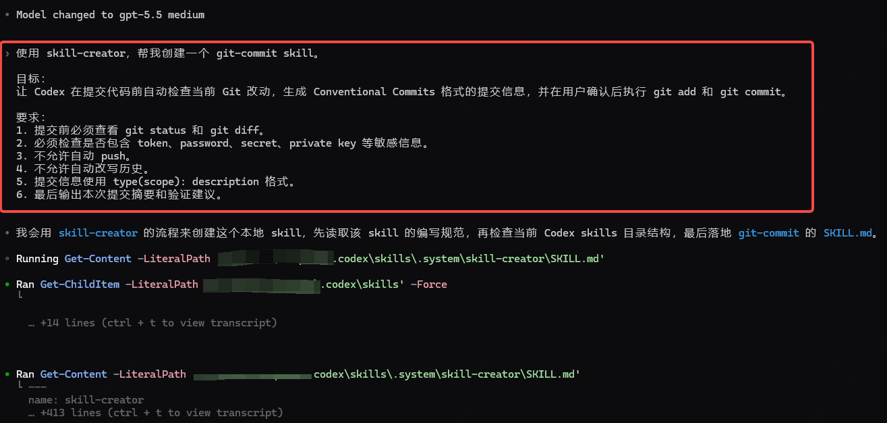
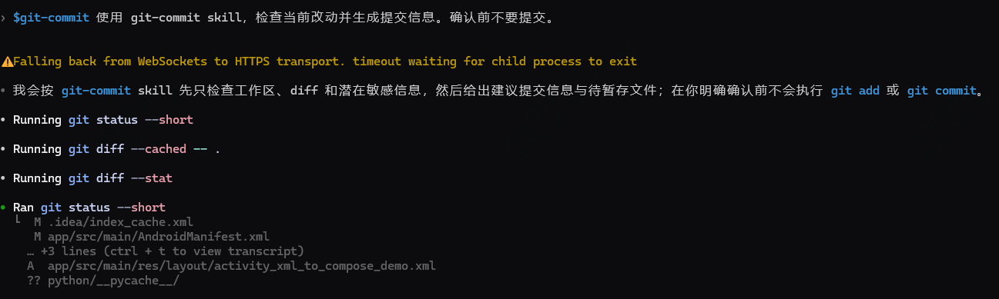
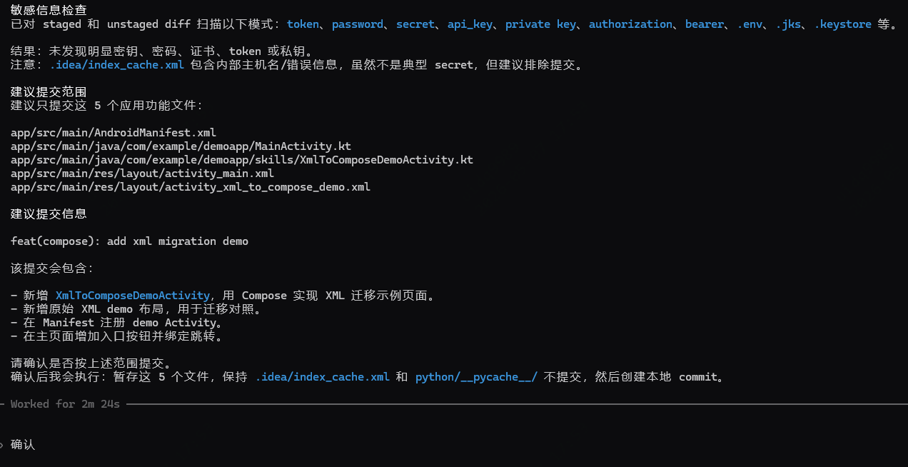
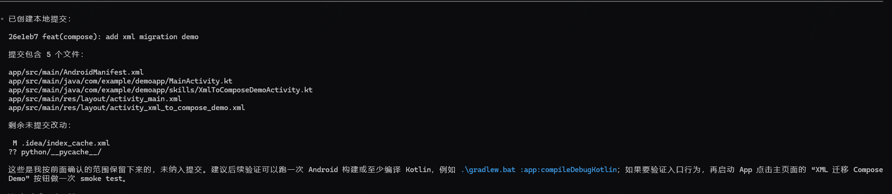

# Skill：AI Agent 的可复用工作流（五）：使用 Codex Skill Creator 创建自己的 Skill

---

前面一篇文章里，我们看了 Google 官方 Android Skills 是怎么写的。

它给我的最大启发，不是“官方又提供了几个可以直接用的能力”，而是：**复杂工程任务可以被写成 AI Agent 能读取、能执行、能验证的任务手册**。

这篇文章继续往前走一步：不只是使用官方 Skill，而是用 Codex 的 `skill-creator` 创建一个自己的 Skill。

这次我选择一个非常经典、也非常日常的例子：`git-commit`。

它要解决的问题很简单：让 Codex 在提交代码前检查当前改动，生成规范的提交信息，并且只在用户确认后执行提交。

---

## 1. 为什么要自定义 Skill

很多时候，我们使用 AI 编程工具时，会写一段很长的 Prompt。

比如：

```text
帮我看一下当前 git 改动，总结一下改了什么，
生成一个符合 Conventional Commits 的提交信息，
检查一下有没有敏感信息，不要直接 push，
提交前先让我确认。
```

这当然可以用。

但问题是，每次都要重新写一遍，而且只要 Prompt 少写一个条件，AI 就可能遗漏某个关键步骤。

比如：

- 没有先看 `git diff`
- 没有检查无关文件
- 没有检查 token、password、secret
- 提交信息格式不统一
- 还没确认就直接执行提交

这类任务非常适合写成 Skill。

因为 Skill 解决的不是“这一次怎么提示 AI”，而是“以后遇到这类任务，AI 都应该按什么流程做”。

可以简单理解为：

```text
Prompt：这一次我要你怎么做
Skill：以后遇到这类任务，你都应该怎么做
```

官方 Skill 解决的是通用工程问题，比如 Android 的 AGP 升级、XML 到 Compose 迁移、Edge-to-Edge 适配。

自定义 Skill 解决的则是我们自己的工作流问题，比如提交代码、写 PR 描述、整理发布说明、接入团队埋点、生成测试模板。

它们的底层思路是一样的：**把人脑里的默认流程，写成 AI Agent 可以执行的流程**。

---

## 2. Codex Skill Creator 是什么

`skill-creator` 是 Codex 用来创建或优化 Skill 的系统 Skill。

它不是简单帮我们保存一段 Prompt，而是引导我们把一个任务拆清楚：

- Skill 名称
- 功能描述
- 适用场景
- 执行目标
- 执行边界
- 执行步骤
- 验证方式

一个 Skill 通常由一个独立目录组成，最核心的文件是 `SKILL.md`。

按照 Skills 的典型目录结构，一个 Skill 大概会长这样：

```text
git-commit/
├── SKILL.md
├── agents/
│   └── openai.yaml
├── references/
├── scripts/
└── assets/
```

其中：

- `SKILL.md`：必需文件，定义 Skill 的名称、描述、目标、约束和执行流程
- `agents/openai.yaml`：可选文件，用来补充 Codex 界面里展示的名称、简介和默认提示
- `references/`：可选目录，存放更详细的参考文档，Codex 需要时再读取
- `scripts/`：可选目录，存放可执行脚本，适合放确定性强、重复执行的工具逻辑
- `assets/`：可选目录，存放模板、图片、示例文件等输出资源

也就是说，最小可用的 Skill 只需要一个 `SKILL.md`。

但如果一个 Skill 变复杂了，就可以把详细规则放进 `references/`，把稳定脚本放进 `scripts/`，把模板资源放进 `assets/`。这样 `SKILL.md` 仍然保持简洁，Codex 也不需要一开始就把所有资料都读进上下文。

`SKILL.md` 里一般包含两部分：

- YAML frontmatter：告诉 Codex 这个 Skill 叫什么、什么时候适合使用
- Markdown 正文：告诉 Codex 具体应该按什么流程执行

如果当前 Codex 环境已经内置 `skill-creator`，可以直接点名使用：

```text
使用 skill-creator，帮我创建一个 git-commit skill。
```

如果需要手动安装，也可以使用 Codex / OpenAI Skills 的安装方式：

```bash
npx skills add https://github.com/openai/skills --skill skill-creator
```

这里还有一个小细节：**Skill 并不要求全文必须是英文**。

我更推荐的写法是：

```text
英文元数据 + 中文正文
```

也就是 `name`、`description`、`keywords` 尽量用英文，方便 Codex 识别和触发；正文部分可以用中文，方便团队成员阅读和维护。

---

## 3. 示例：创建一个 git-commit Skill

这篇文章里，我们用 `git-commit` 作为第一个自定义 Skill 示例。

`git commit` 看起来只是一条命令，但一次靠谱的提交，通常不只是执行 `git commit -m "xxx"`。

它至少包含这些动作：

- 检查当前修改
- 理解具体 diff
- 判断是否有无关文件
- 检查是否包含敏感信息
- 生成清晰的提交信息
- 等用户确认后再提交
- 是否 push 单独确认

这些步骤非常适合写进 Skill。

### 3.1 让 skill-creator 帮我们创建 Skill

可以在 Codex 中输入：

```text
使用 skill-creator，帮我创建一个 git-commit skill。

目标：
让 Codex 在提交代码前自动检查当前 Git 改动，生成 Conventional Commits 格式的提交信息，并在用户确认后执行 git add 和 git commit。

要求：
1. 提交前必须查看 git status 和 git diff。
2. 必须检查是否包含 token、password、secret、private key 等敏感信息。
3. 不允许自动 push。
4. 不允许自动改写历史。
5. 提交信息使用 type(scope): description 格式。
6. 最后输出本次提交摘要和验证建议。
```


这段 Prompt 的重点不是“让 AI 写一个提交信息”，而是提前把任务边界说清楚：

- 要检查
- 要总结
- 要识别风险
- 要生成规范提交信息
- 要等确认
- 不要自动 push

这就是 Skill 和普通 Prompt 最大的不同。

### 3.2 skill-creator 实际生成的 SKILL.md

下面是使用 `skill-creator` 实际生成后的 `git-commit` Skill 示例。

````md
---
name: git-commit
description: Inspect current Git changes, check for sensitive content, generate a Conventional Commit message, and create a local commit only after explicit user confirmation. Use when the user asks Codex to commit changes, prepare a commit, generate a commit message from the working tree, or run a safe git add / git commit workflow.
---

# Git Commit

这个 Skill 用于帮助 Codex 安全地完成 Git 提交流程。

## Core Workflow

### 1. Inspect Working Tree

在生成 commit 前，先检查当前工作区：

- 运行 `git status --short`
- 运行 `git diff --stat`
- 运行 `git diff -- .`
- 如果存在 staged changes，还需要运行：

```bash
git diff --cached -- .
```

---

### 2. Identify Commit Scope

分析本次改动范围：

- 总结 modified / added / deleted / renamed files
- 判断是否存在多个不相关逻辑改动
- 如果发现多个独立改动：
  - 不要自动合并提交
  - 需要询问用户如何拆分 commit

---

### 3. Security Check

在 staging 前检查敏感信息。

需要检查：

- token
- password
- passwd
- secret
- API key
- private key
- credential
- authorization header
- bearer token
- `.env`
- signing key
- certificate
- account identifier

针对 diff 和变更文件搜索：

```text
token
password
passwd
secret
api_key
apikey
access_key
private key
BEGIN RSA PRIVATE KEY
BEGIN OPENSSH PRIVATE KEY
authorization
bearer
credential
client_secret
.p12
.jks
.keystore
.env
```

如果发现疑似敏感内容：

- 立即停止流程
- 不要输出真实 secret
- 仅高层级说明风险文件和上下文
- 在用户处理前不得继续 commit

---

### 4. Generate Conventional Commit Message

commit subject 必须严格使用：

```text
type(scope): description
```

推荐 `type`：

- feat
- fix
- docs
- style
- refactor
- perf
- test
- build
- ci
- chore
- revert

规则：

- `type` 保持英文
- `scope` 保持英文
- `description` 推荐简洁英文
- 使用 lowercase 风格
- 尽量使用 imperative mood
- scope 应尽量 narrow，基于 affected module / feature / tooling area
- commit body 可使用中文
- 仅在能明显提升可追溯性时添加 body

示例：

```text
feat(auth): add oauth login support
fix(cache): prevent stale query results
docs(readme): update installation guide
```

带 body 示例：

```text
feat(order): support batch export

- 新增订单批量导出功能
- 支持 CSV 与 Excel
- 修复大数据量导出超时问题
```

---

### 5. Require Explicit Confirmation

在修改 Git 状态前必须获得用户明确确认。

需要展示：

- 准备 stage 的文件
- commit subject
- commit body（如果存在）
- 风险检查结果

然后等待用户确认。

未经确认：

- 不允许执行 `git add`
- 不允许执行 `git commit`

---

### 6. Create Commit

用户确认后：

```bash
git add <confirmed-files>
```

然后再次检查：

```bash
git status --short
git diff --cached --stat
```

执行 commit：

```bash
git commit -m "<type(scope): description>"
```

如果存在 body：

```bash
git commit \
  -m "<type(scope): description>" \
  -m "<body>"
```

仅允许提交用户确认的文件。

---

### 7. Verify Result

提交完成后运行：

```bash
git status --short
git log -1 --oneline
```

总结：

- commit hash
- commit message
- committed files
- remaining changes in working tree

---

## Prohibitions

禁止执行：

- `git push`
- `git commit --amend`
- `git rebase`
- `git reset`
- `git filter-branch`
- `git filter-repo`

禁止：

- stage 未 review 文件
- commit 未检查 diff 的内容
- commit 含敏感信息的文件
- 跳过用户确认流程

---

## Final Response

结束时必须包含：

- commit summary
  - hash
  - Conventional Commit subject
  - committed files

- remaining uncommitted changes

- verification suggestions，例如：

  - unit tests
  - build commands
  - lint
  - smoke tests
  - UI validation
````

这份实际生成的 `SKILL.md` 比前面的设想更细。

它不是简单写一句“生成提交信息”，而是把一次安全提交拆成了几个明确阶段：

- 先检查 working tree
- 再判断 commit scope
- 再做 security check
- 再生成 Conventional Commit message
- 再等待 explicit confirmation
- 用户确认后才 create commit
- 最后 verify result

对我来说，最值得注意的是两个部分：`Security Check` 和 `Prohibitions`。

因为 `git commit` 是一个会改变仓库状态的操作，所以 Skill 必须明确写出哪些命令不能执行、哪些文件不能提交、什么时候必须停下来等用户确认。

比如：

```text
未经确认，不允许执行 git add / git commit。
禁止执行 git push / git commit --amend / git rebase / git reset。
```

这就是把工程安全边界写进 Skill。

---

## 4. 使用 git-commit Skill 的效果验证

创建好 Skill 后，就可以在一个真实项目里测试。

```text
使用 git-commit skill，检查当前改动并生成提交信息。确认前不要提交。
```



理想情况下，Codex 不应该直接执行提交，而是先输出类似这样的结果：

```text
变更摘要：
- 新增 Codex Skill Creator 博客草稿
- 补充 git-commit Skill 示例

风险检查：
- 未发现 token、password、secret、private key
- 未发现构建产物或大文件
- 当前改动集中在 docs 文档目录

建议提交信息：
docs(skill): add git commit skill creator article

等待确认：
是否执行 git add 和 git commit？
```



确认后，Codex 才会执行类似命令：



这个验证过程能看出 Skill 的价值。

普通 Prompt 很容易只停留在“帮我写一个提交信息”。

而 `git-commit` Skill 让 Codex 按固定流程完成：

- 先检查改动
- 再识别风险
- 再生成提交信息
- 最后等待确认

这才是一个可复用工作流。

---

## 5. 小结：Skill 不是保存 Prompt，而是沉淀流程

写到这里，可以把自定义 Skill 的核心再收一下。

Skill 不是把一段常用 Prompt 存起来。

它更像是把一类任务的执行经验沉淀成结构化流程。

一个好的 Skill 至少要回答四个问题：

- 这个 Skill 是什么
- 它适合什么场景
- 它不应该做什么
- 它应该按什么步骤执行

`git-commit` 这个例子虽然很小，但它完整体现了这些要素。

它不是让 Codex “自动提交代码”，而是让 Codex 在提交前像一个谨慎的开发者一样，先看状态、再看 diff、检查风险、生成提交信息，最后等待确认。

这也是我从 Google 官方 Android Skills 里学到的最重要的一点：

```text
Skill 的重点不是让 AI 更自由，而是让 AI 在复杂任务里更有边界、更有流程、更可验证。
```

从官方 Android Skills 到自己的 `git-commit` Skill，本质上是一件事：

**把人脑里的默认流程，写成 AI Agent 能读取、能执行、能验证的任务手册。**
