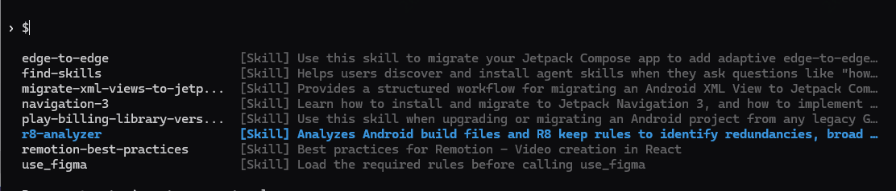
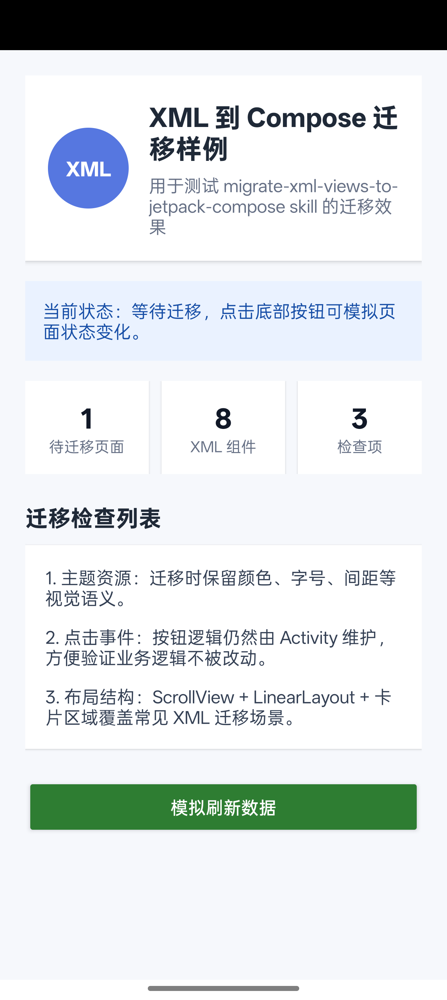
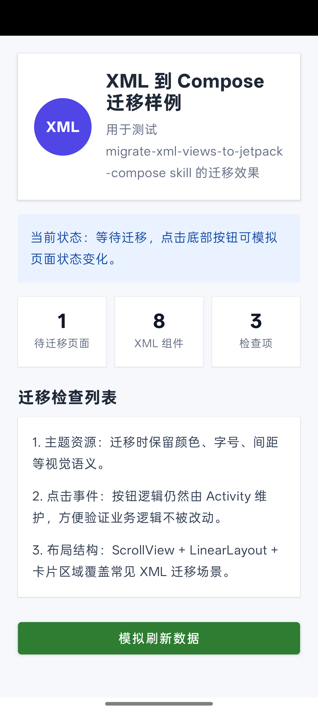

# Skill：AI Agent 的可复用工作流（一）：Android 官方 Skills 实践

---

## 1. 什么是 Skill

在聊 Android Skills 之前，先把 **Skill** 这个概念讲清楚。

很多人第一次看到 Skill，会下意识把它理解成插件、脚本或者某种自动化工具。但实际上，Skill 的本质更接近一份 **写给 AI Agent 的任务操作手册**。

它不是让开发者手动阅读后照着一步步操作的普通文档，而是让 Codex、Gemini、Claude Code、Cursor 这类 AI Agent 在执行某一类任务时，提前知道任务边界、执行步骤和验证方式。

可以把它理解成这样：

> [!TIP]
> 开发者任务 → Codex / Agent → 读取 SKILL.md → 分析 / 修改 / 验证 → 输出可审查结果

换句话说，普通 Prompt 只能告诉 AI：**我要做什么**。

而 Skill 会进一步告诉 AI：**这类任务应该怎么做**。

这就是 Skill 最核心的价值。

### 1.1 Skill 的基本结构

一个 Skill 通常就是一个独立目录，核心文件是 `SKILL.md`，旁边可能还会有 `references/` 目录，用来存放更详细的技术参考资料。

以 Android 官方 Skills 为例，一个典型目录结构大概是这样：

```text
edge-to-edge/
├── SKILL.md
└── references/
```

其中：

- `SKILL.md`：描述这个 Skill 的名称、适用场景、执行步骤、约束条件和验证方式
- `references/`：存放更完整的官方参考资料，供 Agent 在需要时继续读取

`SKILL.md` 一般会包含 YAML 元数据和 Markdown 正文。YAML 部分用于告诉 Agent 这个 Skill 的名字和适用场景，Markdown 正文则是具体的任务指导。

可以把它理解为：

```text
Skill = 元数据 + 任务流程 + 约束规则 + 参考资料
```

它解决的不是“AI 有没有能力写代码”的问题，而是“AI 能不能按照某个专业领域的正确流程写代码”的问题。

### 1.2 Skill 和普通 Prompt 的区别

在没有 Skill 的情况下，我们通常会写很长的 Prompt，试图把所有要求一次性塞给 AI。

例如：

```text
帮我把这个 XML 页面迁移到 Compose，不要改业务逻辑，保留原来的 ViewModel，
注意主题、资源、点击事件，最好能渐进式迁移，先不要删除旧 XML。
```

这种方式当然能用，但有几个问题：

- 每次都要重新写一遍，复用性差
- Prompt 写得不够完整时，AI 容易遗漏关键步骤
- 换一个模型或换一次会话，执行效果可能不稳定
- 团队里每个人写 Prompt 的习惯不同，产出质量也会波动

Skill 的思路是把这类稳定的任务经验沉淀下来，变成可复用的结构化能力。

以后你只需要告诉 Agent：

```text
使用 migrate-xml-views-to-jetpack-compose skill，把这个 XML 页面迁移到 Compose。
```

Agent 就可以根据 Skill 中定义好的流程去分析项目、制定迁移方案、控制修改范围并给出验证建议。

所以，Prompt 更像一次性的任务描述；Skill 更像可以反复使用的专项能力。

> [!NOTE]
> **普通 Prompt**
> 临时描述需求，质量依赖提示词完整度。适合简单任务，但复杂迁移容易遗漏步骤和边界。
>
> [!TIP]
> **Skill**
> 预先沉淀任务流程，告诉 Agent 这类任务应该怎么做。适合迁移、升级、适配、分析等复杂任务。

### 1.3 Skill 和 Rules、MCP 的区别

前面几篇文章里，我们已经聊过 Cursor Rules 和 MCP。Skill 和它们并不是同一种东西，但三者可以组合使用。

简单来说，三者分工可以这样看：

| Rules | MCP | Skill |
|---|---|---|
| 管规范 | 管上下文 / 工具 | 管任务流程 |
| 让 AI 遵守团队代码风格和架构约束 | 让 AI 获取 Figma、内部文档、接口等外部信息 | 让 AI 按专项任务步骤执行 |

所以它们的分工并不冲突。

如果把 AI Agent 当成一个团队成员，Rules 像团队开发规范，MCP 像它能访问的工具和资料库，Skill 像某个专项任务的 SOP。

这也是为什么 Android 官方 Skills 值得关注。它不是再写一篇“教你如何升级 AGP”或“教你如何迁移 Compose”的文章，而是把这些官方推荐流程变成 Agent 可以直接读取和执行的任务知识。

### 1.4 为什么 Android 场景特别适合 Skill

Android 开发里有很多任务，表面上是“改代码”，实际上是“工程迁移”。

比如：

- AGP 升级不是只改版本号，还要检查 Gradle DSL、Kotlin、KSP、废弃配置和构建验证
- XML 迁移到 Compose 不是只做控件映射，还要处理主题、资源、生命周期、互操作和视觉一致性
- Edge-to-Edge 适配不是只调用 `enableEdgeToEdge()`，还要处理 WindowInsets、Scaffold padding、IME、Dialog、BottomBar 等细节
- R8 优化不是随便删 keep 规则，还要判断反射、序列化、JNI、WebView JS Bridge 和第三方 consumer rules
- Play Billing 升级不是简单替换 API，还涉及商品模型、订阅 offer、购买确认、服务端校验和 Play Console 配置

这些任务都有一个共同特点：**步骤多、边界多、验证点多，任何一步漏掉都可能埋坑**。

而 Skill 的价值，正好在这里。

它能帮助 Agent 在开始写代码之前先理解任务边界，在修改过程中控制影响范围，在修改完成后主动给出验证路径。

这让 AI 不只是“生成代码”，而是更接近“按 Android 官方实践完成一次工程任务”。

## 2. Google 官方 Android Skills 要解决什么

### 2.1 通用 AI 写 Android 的问题

现在的 AI 编程工具已经能熟练生成 Kotlin、XML、Jetpack Compose，甚至可以修改 Gradle 配置。

但 Android 项目里的很多任务并不是“写一段代码”，而是一次完整的工程迁移。比如 AGP 升级不只是改版本号，XML 迁移到 Compose 不只是控件映射，edge-to-edge 适配也不只是调用 `enableEdgeToEdge()`。

这些任务背后都有大量隐含规则：版本兼容、资源迁移、生命周期、主题、构建验证、UI 对比、回滚路径等。

通用 AI 的问题在于：它可能会写代码，但不一定知道 Android 官方推荐的完整执行流程。

### 2.2 Android Skills 的作用

Google 官方 Android Skills 要解决的，就是让 AI Agent 不再只靠 Prompt 和模型记忆来做 Android 任务。

它把 Android 官方推荐的迁移步骤、注意事项、验证方式和风险边界，整理成 Agent 可以读取的 `SKILL.md` 和 `references/`。

简单来说：

```text
Prompt 告诉 AI：我要做什么
Skill 告诉 AI：这类任务应该怎么做
```

以前是开发者读官方文档，然后手动迁移、手动验证。

现在可以变成：

```text
开发者表达任务意图
→ Agent 读取对应 Skill
→ Agent 按流程分析项目
→ Agent 控制修改范围
→ Agent 给出修改结果和验证建议
```

## 3. Google 官方 Android 6 大核心 Skills 与 Codex CLI 使用

Android 官方目前提供的 Skills，覆盖的是 Android 开发中最常见、也最容易踩坑的几类工程任务。

### 3.1 Android 官方 6 大核心 Skills

> [!TIP]
> **`agp-9-upgrade`** — 构建升级：AGP 9 / Gradle / Kotlin / KSP

> [!TIP]
> **`migrate-xml-views-to-jetpack-compose`** — UI 迁移：XML → Compose

> [!TIP]
> **`navigation-3`** — 导航架构：Jetpack Navigation 3

> [!TIP]
> **`r8-analyzer`** — 包体积优化：R8 / ProGuard keep 规则

> [!TIP]
> **`play-billing-library-version-upgrade`** — 支付升级：Google Play Billing Library

> [!TIP]
> **`edge-to-edge`** — 系统适配：Android 15 edge-to-edge

这 6 个 Skill 的共同点是：它们都不是”写一个函数”这种简单任务，而是需要分析上下文、控制边界、分步骤验证的工程任务。

比如 XML 到 Compose 迁移，真正重要的不是把 `TextView` 翻译成 `Text`，而是保持原有业务逻辑不变，尽量渐进式接入 Compose，并在迁移后验证 UI 和交互是否一致。

### 3.2 从 0 到 1：使用 Android CLI 安装 Android Skills

官方推荐通过 **Android CLI** 来安装和管理 Android Skills。这样做的好处是不用手动去复制 Skill 目录，CLI 会帮你发现、下载并安装到对应 Agent 的 skills 目录中。

整体流程如下：

> [!TIP]
> 下载 Android CLI → android update → android init → android skills list → android skills add --all → 重启 Codex CLI → 点名 Skill

官方入口：

- [Android CLI 官方文档](https://developer.android.com/tools/agents/android-cli)
- [Android Skills 官方文档](https://developer.android.com/tools/agents/android-skills)
- [Android Skills GitHub 仓库](https://github.com/android/skills)

---

**第一步：下载并配置 Android CLI**

进入官方下载页面，下载对应系统的 Android CLI 二进制文件，将 `android` 命令加入系统环境变量。

验证安装是否成功：

```bash
android --help
```

看到帮助信息说明命令已就绪。建议顺手更新到最新版本：

```bash
android update
```

---

**第二步：初始化 Agent 使用环境**

```bash
android init
```

这一步会向 Agent 的 skills 目录中安装 `android-cli` skill，让 Agent 更容易理解和使用 Android CLI 本身。相当于给 Agent 读一本"怎么用 android 命令"的说明书。

---

**第三步：查看可安装的 Skills 列表**

```bash
android skills list
```

可以看到当前所有可安装的官方 Skills。查看详细信息可加 `--long` 参数：

```bash
android skills list --long
```

---

**第四步：安装 Skills**

安装全部官方 Skills：

```bash
android skills add --all
```

安装指定单个 Skill：

```bash
android skills add --skill=edge-to-edge
```

指定安装到某个 Agent（例如 Codex）：

```bash
android skills add --all --agent=codex
```

> 注意：不同工具对 Agent 名称的识别可能不一致。如果不指定 `--agent`，Android CLI 会自动选择它检测到的 Agent。

---

**第五步：验证安装结果**

检查 Codex 的 skills 目录，Windows 上一般在：

```text
C:\Users\<用户名>\.codex\skills
```

正常情况下应该看到六个 Skill 目录：



```text
.codex/skills/
├── agp-9-upgrade/
├── edge-to-edge/
├── migrate-xml-views-to-jetpack-compose/
├── navigation-3/
├── play-billing-library-version-upgrade/
└── r8-analyzer/
```

每个目录下都有 `SKILL.md`，这是 Agent 实际读取的文件。

---

**第六步：重启 Codex 并开始使用**

安装完成后，重启 Codex CLI 或新开一个会话，让 Agent 重新加载 Skills。

进入你的真实 Android 项目（注意不是 Android Skills 仓库本身）：

```bash
cd D:\CodeStation\YourAndroidProject
codex
```

在 Codex 中使用 Skill，最稳的方式是直接在 Prompt 里点名：

```text
使用 migrate-xml-views-to-jetpack-compose skill，先分析 app/src/main/res/layout/fragment_home.xml 的迁移方案，不要改代码。
```

确认方案可行后，再让 Codex 执行修改并验证：

```text
按刚才的方案修改代码，并运行 ./gradlew :app:compileDebugKotlin 验证。
```

这样整个链路就跑通了：**Android CLI 负责安装**，**Codex 负责读取 Skill 并执行任务**，**开发者负责确认方案和验收结果**。

## 4. Demo：使用 XML → Compose Skill 完成一次迁移

这一节用 `DemoApp` 里的一个真实页面做演示：

```text
D:\CodeStation\github\DemoApp
```

迁移目标是一个典型 XML 页面：

```text
app/src/main/res/layout/activity_xml_to_compose_demo.xml
```

关联 Activity：

```text
app/src/main/java/com/example/demoapp/skills/XmlToComposeDemoActivity.kt
```

这个 Demo 页面刻意使用了 `ScrollView`、`LinearLayout`、`TextView`、`Button`、状态文案和卡片区域，方便观察 XML 到 Compose 的迁移效果。

迁移前效果：



### 4.1 使用的 Prompt

在 `DemoApp` 项目根目录打开 Codex CLI，直接输入：

```text
使用 migrate-xml-views-to-jetpack-compose skill，把当前项目中的 XML Demo 页面迁移到 Jetpack Compose。

目标文件：
app/src/main/res/layout/activity_xml_to_compose_demo.xml

关联 Activity：
app/src/main/java/com/example/demoapp/skills/XmlToComposeDemoActivity.kt

要求：
1. 只迁移 UI，不重构业务逻辑。
2. 保留 refreshCount、状态文案更新和按钮点击行为。
3. 可以使用 ComposeView 渐进式接入。
4. 不要删除旧 XML 文件，保留作为迁移前对照。
5. 修改后运行 .\gradlew.bat :app:compileDebugKotlin 验证。
6. 最后总结修改文件和验证结果。
```

这段 Prompt 的重点是控制迁移边界：**只迁移 UI，不顺手重构业务逻辑**。

### 4.2 迁移前：典型 XML 写法

迁移前，页面由 XML 承载。这里截取几个典型片段：

```xml
<ScrollView
    android:layout_width="match_parent"
    android:layout_height="match_parent"
    android:background="#F6F8FC"
    android:fillViewport="true">

    <LinearLayout
        android:layout_width="match_parent"
        android:layout_height="wrap_content"
        android:orientation="vertical"
        android:padding="20dp">

        <TextView
            android:id="@+id/tv_migration_status"
            android:layout_width="match_parent"
            android:layout_height="wrap_content"
            android:layout_marginTop="16dp"
            android:background="#EAF2FF"
            android:padding="14dp"
            android:text="当前状态：等待迁移，点击底部按钮可模拟页面状态变化。"
            android:textColor="#174EA6"
            android:textSize="14sp" />

        <Button
            android:id="@+id/btn_refresh_xml_demo"
            android:layout_width="match_parent"
            android:layout_height="wrap_content"
            android:layout_marginTop="22dp"
            android:backgroundTint="#2E7D32"
            android:text="模拟刷新数据"
            android:textColor="@android:color/white" />
    </LinearLayout>
</ScrollView>
```

Activity 中原本只需要负责绑定按钮和更新状态：

```kotlin
setContentView(R.layout.activity_xml_to_compose_demo)

val statusText = findViewById<TextView>(R.id.tv_migration_status)
val refreshButton = findViewById<Button>(R.id.btn_refresh_xml_demo)

refreshButton.setOnClickListener {
    refreshCount++
    statusText.text = "XML 页面状态已刷新 $refreshCount 次，业务逻辑保持在 Activity 中。"
}
```

### 4.3 迁移后：ComposeView 渐进式接入

迁移后，旧 XML 文件没有删除，Activity 改为通过 `ComposeView` 接入 Compose UI：

```kotlin
private var refreshCount = 0
private var statusText by mutableStateOf(INITIAL_STATUS_TEXT)

override fun onCreate(savedInstanceState: Bundle?) {
    super.onCreate(savedInstanceState)

    setContentView(
        ComposeView(this).apply {
            setViewCompositionStrategy(ViewCompositionStrategy.DisposeOnViewTreeLifecycleDestroyed)
            setContent {
                MaterialTheme {
                    XmlToComposeDemoScreen(
                        statusText = statusText,
                        onRefreshClick = {
                            refreshCount++
                            statusText = "XML 页面状态已刷新 $refreshCount 次，业务逻辑保持在 Activity 中。"
                        }
                    )
                }
            }
        }
    )
}
```

原来的 XML 层级被拆成多个 Composable，例如页面主体和状态区：

```kotlin
@Composable
private fun XmlToComposeDemoScreen(
    statusText: String,
    onRefreshClick: () -> Unit,
    modifier: Modifier = Modifier
) {
    Column(
        modifier = modifier
            .fillMaxSize()
            .background(Color(0xFFF6F8FC))
            .verticalScroll(rememberScrollState())
            .padding(20.dp)
    ) {
        HeaderCard()
        StatusBlock(statusText)
        MetricsRow()
        ChecklistCard(items = listOf(...))

        Button(
            modifier = Modifier
                .fillMaxWidth()
                .padding(top = 22.dp),
            onClick = onRefreshClick
        ) {
            Text(text = "模拟刷新数据")
        }
    }
}
```

```kotlin
@Composable
private fun StatusBlock(statusText: String) {
    Text(
        modifier = Modifier
            .fillMaxWidth()
            .padding(top = 16.dp)
            .background(Color(0xFFEAF2FF))
            .padding(14.dp),
        text = statusText,
        color = Color(0xFF174EA6),
        fontSize = 14.sp
    )
}
```

迁移后效果：



可以看到，迁移后的页面视觉结构和迁移前基本保持一致：标题区、状态提示、统计卡片、检查列表和底部按钮都被保留下来，只是 UI 实现方式从 XML 切换成了 Compose。

这次迁移的关键点是：旧 XML 保留作为对照，页面通过 `ComposeView` 渐进式接入 Compose，`refreshCount`、状态文案更新和按钮点击行为仍然保留在 Activity 中。也就是说，迁移的是 UI 表达方式，而不是业务逻辑。

这也正是 `migrate-xml-views-to-jetpack-compose` skill 的价值：它不是简单做控件翻译，而是帮助 Codex 在迁移过程中守住边界，尽量做到视觉一致、逻辑不变、过程可验证。

## 5. 解析 migrate-xml-views-to-jetpack-compose Skill：官方是如何写一个迁移任务的

前面的 Demo 展示了怎么使用这个 Skill。接下来再回头看一下官方 `SKILL.md` 本身，看看 Google 是如何把“XML 到 Compose 迁移”写成 AI Agent 可执行流程的。

参考文件：

```text
D:\CodeStation\github\skills\jetpack-compose\migration\migrate-xml-views-to-jetpack-compose\SKILL.md
```

### 5.1 先声明自己：这个 Skill 是谁、解决什么问题

官方 Skill 开头是一段 YAML 元数据：

```yaml
name: migrate-xml-views-to-jetpack-compose
description: Provides a structured workflow for migrating an Android XML View to Jetpack Compose.
metadata:
  author: Google LLC
  keywords:
  - Jetpack Compose
  - migration
  - XML
  - Views
  - interoperability
  - incremental adoption
```

一个 Skill 首先要让 Agent 知道：我是谁、什么时候该用我、我解决什么问题。

`name` 是 Agent 识别 Skill 的稳定名称；`description` 用来描述适用场景；`keywords` 则进一步标记这个 Skill 的领域关键词。

这里最值得注意的是两个词：`interoperability`（互操作性）和 `incremental adoption`（渐进式接入）。

它们说明官方并不是鼓励一次性推倒重写，而是强调新旧 UI 的互操作和渐进式迁移。

官方在 `Objective`（目标）中先定义迁移目标：

```text
To systematically convert a single legacy XML layout into modern, declarative Jetpack Compose UI while maintaining pixel-perfect visual parity and functional integrity.
```
（系统化地将单个遗留 XML 布局转换为现代声明式 Jetpack Compose UI，同时保持像素级视觉一致性和功能完整性。）

这句话其实定义了整个 Skill 的边界。

它不是“把项目迁移到 Compose”，而是“把一个 legacy XML layout 系统化迁移到 Compose”。

这里有几个关键词：

- `single legacy XML layout`（单个遗留 XML 布局）：一次只迁移一个 XML 布局，避免范围失控
- `declarative Jetpack Compose UI`（声明式 Jetpack Compose UI）：迁移目标是声明式 Compose UI
- `visual parity`（视觉一致）：迁移前后视觉要尽量一致
- `functional integrity`（功能完整性）：功能行为不能被破坏

这就是官方 Skill 的第一个启发：先定义清楚目标，再让 Agent 动手。

原文里还有一句非常关键：

```text
This skill migrates UI (XML to Jetpack Compose) only.
```
（此 Skill 仅迁移 UI，即 XML → Jetpack Compose。）

官方明确告诉 Agent：这个 Skill 只做 UI 迁移，不负责业务逻辑重构。

这也是我们前面 Demo Prompt 里反复强调“不重构业务逻辑”的原因。XML 到 Compose 迁移最容易失控的地方，就是 AI 顺手改 ViewModel、改数据流、改业务状态。

官方 Skill 把边界写在最前面，本质上是在提醒 Agent：迁移 UI 表达方式，不改变业务行为。

### 5.2 再给流程：不是控件映射表，而是迁移路径

官方给出的迁移流程是 10 步：

```text
1. Identify the optimal XML candidate for migration   识别候选 XML
2. Analyze the project and layout                   分析项目和布局
3. Create a plan                                    制定迁移计划
4. Capture the XML View UI                          捕获迁移前 UI
5. Set up Compose dependencies and compiler         配置依赖和编译器
6. Set up Compose theming                           配置 Compose 主题
7. Migrate the XML layout to Compose                迁移布局到 Compose
8. Validate the migration                           验证迁移结果
9. Replace usages                                   替换引用
10. XML code removal                                清理旧 XML
```

这 10 步很能体现官方 Skill 的写法。

它没有一上来就告诉 Agent `TextView` 对应 `Text`、`LinearLayout` 对应 `Column`，而是先要求 Agent 做候选布局选择、项目分析、迁移计划、截图基准、依赖检查、主题准备、布局迁移、结果验证、引用替换，最后才考虑 XML 清理。

这说明官方关心的不是“控件怎么翻译”，而是“迁移过程是否可控”。

对团队写 Skill 来说，这一点很重要：Skill 不应该只是知识点列表，而应该是一条可执行的任务路径。

前 3 步分别是：

- `Identify the optimal XML candidate`
- `Analyze the project and layout`
- `Create a plan`

这三个动作都发生在真正写代码之前。

也就是说，官方 Skill 要求 Agent 先看清楚上下文：目标 XML 是哪个、周围 Activity/Fragment 怎么使用它、有没有 ViewBinding/DataBinding、相关样式和资源在哪里、迁移风险是什么。

这和我们平时直接让 AI “帮我迁移这个页面”完全不同。

一个好的迁移类 Skill，第一步不是写代码，而是建立上下文。

第 4 步是：

```text
Capture the XML View UI
```

官方 Skill 专门把“捕获迁移前 UI”列为一步，说明视觉验证在 UI 迁移中不是可选项。

因为 XML 到 Compose 迁移不是只要编译通过就算完成。UI 迁移最重要的是迁移前后看起来是否一致，交互是否一致。

这也是为什么我们 Demo 里保留了迁移前后的截图。截图不是装饰，而是迁移验证的一部分。

官方 Skill 在真正迁移布局前，要求先检查 Compose dependencies、compiler 和 Compose theming。

这很符合 Android 工程实际：很多迁移失败不是因为 Composable 写错，而是因为项目没有正确配置 Compose、Compiler、Material Theme，或者新 Compose UI 没有承接原 XML 主题。

尤其是主题部分，官方还强调：

```text
Do not migrate the entire theme. Implement only the minimum theming required.
```
（不要迁移整个主题。只需实现最小必要的主题配置。）

这个约束很重要：不要因为迁移一个页面，就顺手把整个项目主题体系都重构掉。

最后几步才进入真正的迁移：

- `Migrate the XML layout to Compose`
- `Replace usages`
- `Validate the migration`
- `XML code removal`

这里要注意，官方把 XML 删除放在最后一步，而且有明显的 caution：只能删除不再被引用的旧资源。

这说明官方迁移思路是渐进式的，不是“一迁移就删除旧代码”。

我们的 Demo 也遵循了这个思路：先保留旧 XML，Activity 使用 `ComposeView` 接入 Compose，迁移完成后再验证编译和效果。

### 5.3 对我们写团队 Skill 的启发

从这个官方 Skill 可以总结出一个团队级 Skill 的写法：

```text
定义适用场景
→ 明确任务目标
→ 写清楚不做什么
→ 先分析上下文
→ 制定计划
→ 执行最小修改
→ 保留验证路径
→ 最后再清理旧代码
```

这套结构不只适用于 XML 到 Compose。

团队内部的网络接口封装、埋点接入、模块迁移、页面生成、架构重构，都可以按这个思路写成 Skill。

官方 Android Skills 给我们的学习意义就在这里：它不只是一个工具包，更是一份示范，告诉我们如何把工程经验从“写给人看的文档”，升级成“AI Agent 能执行的任务手册”。
