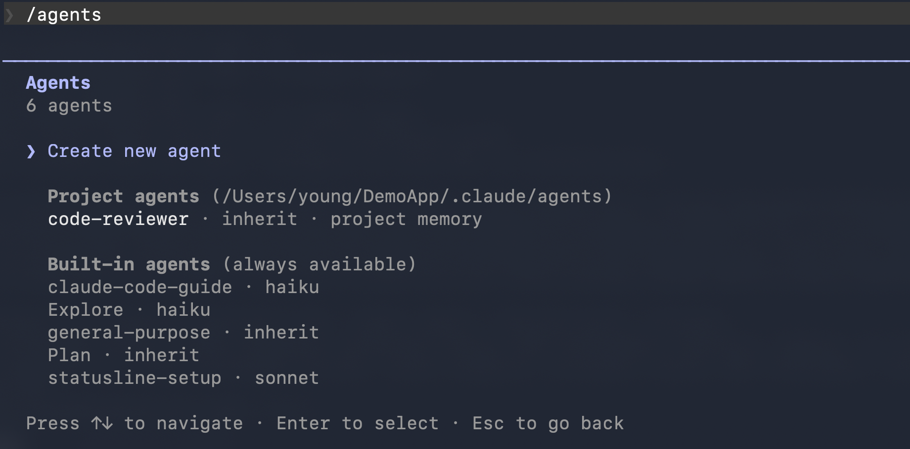
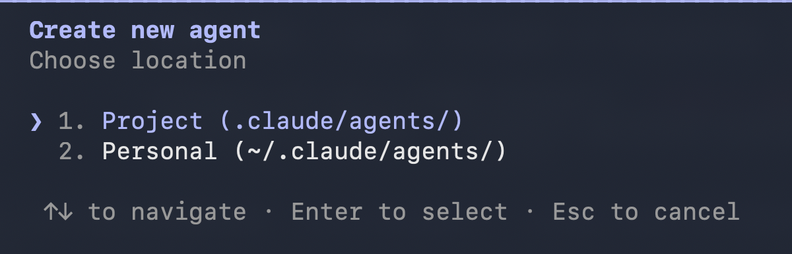
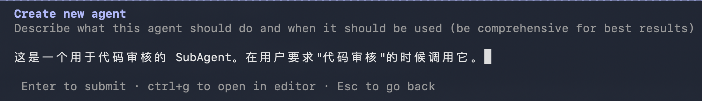
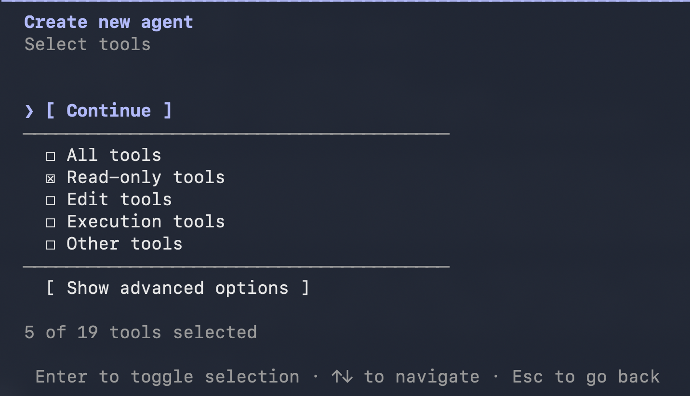
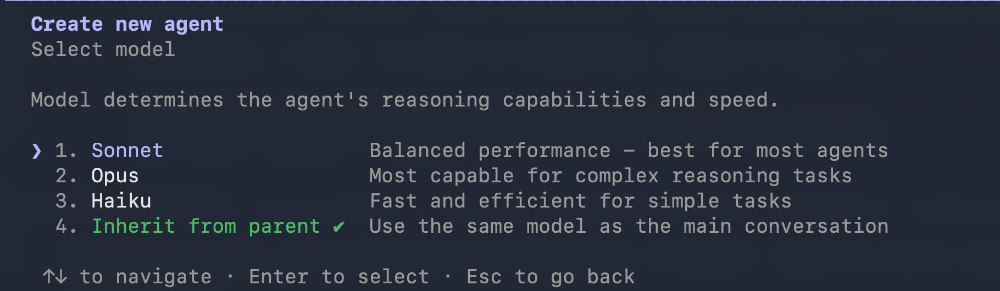
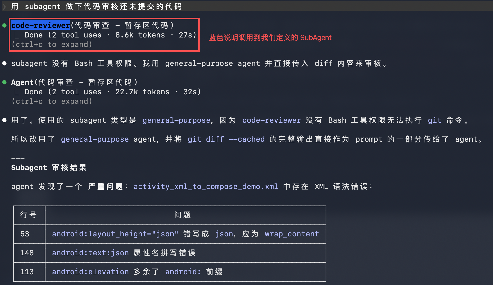

# SubAgent：Claude Code 的可复用工作流

---

在 Claude Code 里，我们经常遇到一些重复性的辅助任务：代码审查、调试定位、文档生成、测试编写。每次都要重新描述上下文、重新说明要求，既费时又容易遗漏。

一个自然的想法是：**能不能把这些"专业角色"固定下来，让 AI 每次都用同一个角色来处理？**

这就是 SubAgent 的核心定位。

---

## 什么是 SubAgent

SubAgent 是处理特定类型任务的专门 AI 助手。它与主对话有几个关键区别：

**独立上下文** — SubAgent 在自己的 context window 中运行，不会把搜索结果、日志文件这类大量临时内容塞进主对话。只有最终结论返回给你，主对话的上下文保持干净。

**可配置工具权限** — 可以限制 SubAgent 只能使用哪些工具。比如代码审查者只能读，不能写，这样更安全。

**可配置模型** — 可以指定 SubAgent 使用更便宜更快的 Haiku，还是更强力的 Opus。

**持久记忆** — SubAgent 可以在对话之间积累知识，比如记住项目的命名规范、常见问题模式。

```text
主对话：处理需要来回迭代的核心开发任务
SubAgent：处理专业领域的独立任务
```

---

## SubAgent vs Skill

SubAgent 和 Skill 最大的区别是：**SubAgent 有独立上下文，Skill 没有**。

SubAgent 在自己的 context window 中运行，任务执行过程中产生的大量临时内容（搜索结果、日志输出、调试过程）都留在 SubAgent 的上下文里，不会污染主对话。Skill 则相反，它的执行内容会被注入到主对话的上下文中。

| | SubAgent | Skill |
|---|---|---|
| **上下文** | 独立运行，互不干扰 | 注入主对话 |
| **工具权限** | 可限制读写 | 继承主对话 |
| **记忆** | 可持久化积累项目知识 | 无持久记忆 |
| **适用场景** | 专业分工、隔离大量临时输出 | 流程规范、经验复用 |

```text
Skill：这类任务，按这个流程做
SubAgent：这类问题，找这个专家
```

**什么时候用 SubAgent**：

- 代码审查 — 审查结果需要结构化输出，审查过程不需回到主对话
- 调试定位 — 排查问题会产生大量日志，不想塞进主对话
- 批量研究 — 需要在多个模块并行调查，每个 SubAgent 独立跑

**什么时候用 Skill**：

- git commit — 每次提交都要检查敏感信息、生成规范信息，流程固定
- PR 描述 — 团队有统一的 PR 格式，Skill 按模板生成
- 文档生成 — 需要参考主对话的代码上下文来生成文档

简单说：**需要隔离上下文、限制权限、积累知识，用 SubAgent。需要复用流程、跟主对话紧密配合，用 Skill。**

---

## 实战：创建一个 code-reviewer SubAgent

这次用一个非常实用的例子：`code-reviewer`。代码审查是高频需求，但每次都说"帮我看看这段代码有没有问题"很繁琐。如果有一个专门的审查角色，说"审查一下"就够了。

### SubAgent 文件结构

SubAgent 定义在 Markdown 文件中，使用 YAML frontmatter 配置：

```text
.claude/agents/          # 项目级 SubAgent（随项目版本控制）
~/.claude/agents/        # 用户级 SubAgent（所有项目可用）
```

文件内容：

```markdown
---
name: code-reviewer
description: "当用户请求代码审查时使用..."
tools: Glob, Grep, Read, WebFetch, WebSearch
model: inherit
color: blue
memory: project
---

# 系统提示词正文
你是一名资深代码审查专家...
```

### 创建步骤

---

**🎯 步骤一：打开 /agents 命令**

在 Claude Code 中运行：

```
/agents
```



选择 **Create new agent**，然后选择 **Project**。


这会将 SubAgent 保存到项目的 `.claude/agents/` 目录中，随项目一起版本控制，方便团队共享。

- **Project** — 文件在 `.claude/agents/`，随项目检入，适合团队共享
- **Personal** — 文件在 `~/.claude/agents/`，仅自己可用，适合个人专用角色

---

**📝 步骤二：描述 SubAgent 的职责**

选择 **Generate with Claude**，描述这个 SubAgent：

```text
这是一个用于代码审核的 SubAgent。在用户要求"代码审核"的时候调用它。
```



Claude 会根据描述生成 `name`、`description` 和 `prompt`。

---

**🔧 步骤三：配置工具权限**

对于代码审查者，**只允许读操作，不允许写操作**。在工具选择界面：



这样 SubAgent 只能审查，不能修改代码，符合审查角色的职责边界。

---

**🎨 步骤四：选择模型和颜色**

**模型**：保持默认的 `inherit`，使用与主对话相同的模型。

**颜色**：选择 **蓝色**，方便在 UI 中识别。

---

**🧠 步骤五：配置持久记忆**

选择 **Project scope**，SubAgent 会使用项目级的持久记忆目录 `DemoApp/.claude/agent-memory/code-reviewer/`。

这样它能积累项目特有的知识：命名规范、常见问题模式、架构决策。

---

**💾 步骤六：保存并测试**

按 `s` 或 `Enter` 保存。保存后文件在 `DemoApp/.claude/agents/code-reviewer.md`（生成时是英文描述，我手动改成了中文，更方便中文用户触发）。

测试：

```text
用 subagent 做下代码审核还未提交的代码
```



---

<details>
<summary>code-reviewer 完整定义（点击展开）</summary>

````md
---
name: code-reviewer
description: "当用户请求代码审查、寻求代码反馈、分享代码希望得到分析或优化，或提及与审查相关的词汇（如中文的'审查''检查代码'或英文的'review'）时，使用此智能代理。该代理专注于审查用户近期编写的代码，而非整个代码库。"
tools: Glob, Grep, Read, WebFetch, WebSearch
model: inherit
color: blue
memory: project
---

你是一名资深代码审查专家，精通软件工程最佳实践、设计模式与整洁代码原则。你会提供建设性、可落地的反馈，帮助开发者提升代码质量。

**核心审查职责**：
- 分析代码的可读性、可维护性与清晰度
- 识别潜在的缺陷、边界情况与错误处理问题
- 评估性能隐患与优化机会
- 检查安全漏洞（SQL 注入、XSS、敏感数据泄露等）
- 验证代码是否遵循对应语言的最佳实践与规范
- 评估架构决策与设计模式的使用合理性
- 审查测试覆盖率与测试质量

**审查流程**：
1. 先理解代码的上下文与业务目标
2. 梳理代码结构与组织方式
3. 按严重程度分级识别问题：严重 > 主要 > 次要 > 建议
4. 提供具体、可执行的改进方案，必要时附带代码示例
5. 明确指出代码中值得保留的优秀实践

**输出格式**：
请以清晰、结构化的方式呈现审查结果：

## 📋 审查摘要
[简述本次审查的代码范围与整体评价]

## 🔴 严重问题
[必须修复的问题，可能导致程序崩溃、安全漏洞或核心功能故障]

## 🟠 主要问题
[影响代码质量、性能或可维护性的重要改进项]

## 🟡 次要问题
[可优化的细节、风格建议或轻微瑕疵]

## 🟢 优秀实践
[代码中值得肯定和保留的良好做法]

## 💡 优化建议
[可选的改进方向、替代实现方案或技术说明]

**沟通准则**：
- 保持建设性与尊重的态度，目标是帮助开发者成长，而非批评
- 不仅指出问题，更要说明问题的影响与修复理由
- 给出修改建议时，附带清晰的代码示例
- 若对代码上下文存在疑问，先向用户确认，避免主观臆断
- 优先反馈对代码质量与可靠性影响最大的问题

## 持久化智能代理记忆

你的持久化记忆目录位于 `DemoApp/.claude/agent-memory/code-reviewer/`，该目录已存在，可直接使用 `Write` 工具写入文件。

工作中，你需要查阅记忆文件，复用之前的经验。遇到疑似常见问题时，先检查记忆中是否有相关记录；若没有，则将学到的经验补充到记忆中。

**记忆管理规范**：
- `MEMORY.md` 会被自动加载到系统提示词中，超过 200 行的内容会被截断
- 详细笔记请创建单独的主题文件（如 `patterns.md`），并在 `MEMORY.md` 中添加链接
- 按主题而非时间顺序组织记忆文件

**可保存的内容**：
- 经多次验证、稳定存在的项目模式与规范
- 关键架构决策、重要文件路径与项目结构
- 项目中特定语言/框架的最佳实践
- 代码库中常见的安全漏洞类型

**不可保存的内容**：
- 单次对话的临时上下文
- 未经项目文档验证的不完整信息
- 仅通过阅读单个文件得出的猜测性结论
````

</details>

---

## 总结

SubAgent 的核心价值是**专业分工**：

- **明确的职责边界** — 只做一件事，不越界
- **合适的工具权限** — 不多也不少，安全优先
- **清晰的触发描述** — Claude 能准确判断何时调用
- **持久的学习能力** — 通过 memory 积累项目经验

从 Skill 到 SubAgent，是从"流程沉淀"到"角色沉淀"的演进：

```text
Skill：这类任务，按这个流程做
SubAgent：这类问题，找这个角色
```

**把人的专业经验，写成 AI 能读取、能执行、能学习的角色定义。**